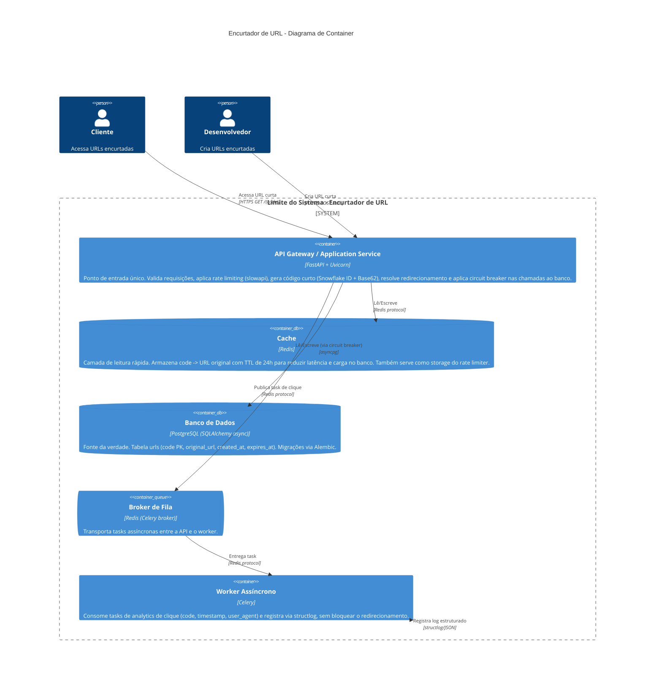

# C4 - Nível 2: Diagrama de Container

## Containers

| Container | Tecnologia | Responsabilidade |
| --- | --- | --- |
| API Gateway / Application Service | FastAPI + Uvicorn | Único ponto de entrada HTTP. Rate limiting (`slowapi`), geração de código (Snowflake + Base62), orquestração cache → circuit breaker → banco, enfileiramento da task de analytics. |
| Cache | Redis | Cache `code -> URL` com TTL de 24h. Também usado como storage do rate limiter. |
| Banco de Dados | PostgreSQL | Fonte da verdade. Tabela `urls`. Acesso assíncrono via SQLAlchemy + `asyncpg`. Migrações via Alembic. |
| Broker de Fila | Redis (DB lógico separado do cache) | Transporta as mensagens de task entre API e worker (broker do Celery). |
| Worker Assíncrono | Celery | Processa a task `log_click`, registrando `code`, `timestamp` e `user_agent` via `structlog`, fora do caminho crítico do redirecionamento. |

## Notas de implementação

- **Circuit breaker** (`pybreaker`): protege as chamadas ao PostgreSQL (commit na criação, select
  na leitura). Após `CIRCUIT_BREAKER_FAIL_MAX` falhas consecutivas, o circuito abre e a API
  responde `503` imediatamente em vez de empilhar timeouts.
- **Cache-aside**: toda leitura primeiro consulta o Redis; em caso de miss, busca no Postgres
  (protegido pelo circuit breaker) e popula o cache antes de responder.
- **Fila assíncrona**: ao contrário do diagrama de referência genérico (que mostra uma
  "Message Queue + DLQ" desacoplada), este projeto usa o Celery com Redis como broker. O Celery
  já oferece retries configuráveis por task; uma DLQ explícita não foi implementada por não ser
  necessária no escopo atual (analytics de clique tolera perda ocasional).
- **Banco relacional em vez de NoSQL**: o diagrama de referência sugere DynamoDB/Cassandra; este
  projeto usa PostgreSQL por requisito explícito do projeto (consistência forte, migrações com
  Alembic, e volume de escrita compatível com um único nó relacional).
