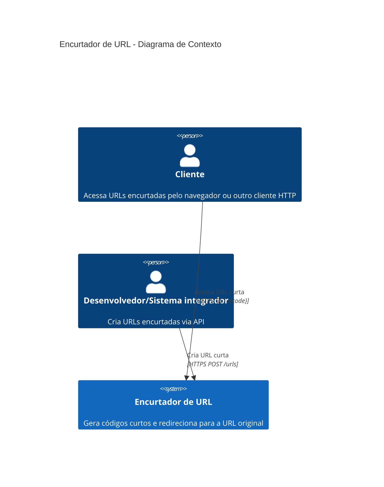

# C4 - Nível 1: Diagrama de Contexto

## Atores

- **Cliente**: qualquer pessoa ou sistema que recebe um link curto e o acessa para ser redirecionado
  à URL original.
- **Desenvolvedor/Sistema integrador**: quem chama `POST /urls` para gerar um novo código curto
  (ex: um backend de outra aplicação, um time de marketing, etc.).

## Sistema

- **Encurtador de URL**: sistema único, todo on-premises/local (sem dependências de nuvem),
  responsável por gerar códigos curtos, persistir o mapeamento `code -> URL original` e redirecionar
  requisições de leitura.
